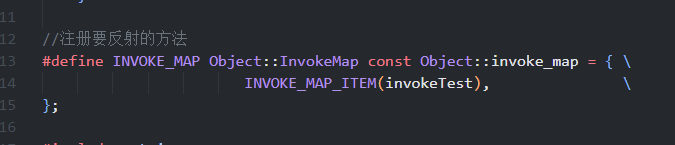

> 思路参考： Qt反射机制的实现，本来想参考UE的UHT的，但是目前理解还透彻UEC++QWQ。
>
> 说明：
>
> 1. 本文和C++ RTTI 机制区分开来，C++RTTI只能获取对象信息，个人不认可他是简单反射机制
> 2. 这里仅仅实现一个能够在运行时，获取一个对象的具有的函数信息（没有参数，没有返回值），没有追求实现一个通用且健全的反射机制。仅仅提供思路指引
> 3. 将程序员编写的代码称之为 **文本代码 、原始代码**
> 4. 将计算机可以直接运行的代码称之为 **二进制代码**

## 反射机制的原理

### 何为反射机制？

一般对反射机制的定义是：程序在 **运行时** ，动态的获取对象的信息的能力。

获取的信息可以是：

1. 该对象的名字
2. 该对象的类型
3. 该对象具有方法：构造，析构，成员方法等
4. ....

**反射机制的作用**

我们可以获取这些信息有啥作用？作用可大了！！

最直接的是 我们可以根据 获取的方法名称（字符串），去调用具体方法。别小看这句话的威力，拥有该机制的编程语言，可以极大的改变我们编程的思想。例如：我们直接可以使用json数据构建出具体对象。

### 原生C++为啥不支持反射机制？

java等语言原生就支持反射机制，为啥c++不可以？

想要理清楚这个问题，我们先要**理解什么决定了一门编程语言是否存在反射的能力: ****在运行期，是否还具有文本代码信息。**

> 下面对java反射机制的理解可能有错误，但是不影响论述反射机制的原理

编程语言可以划分为：编译型和解释型。就以JAVA为例子，java被称之半编译半解释型语言，因为java是将文本代码编译为字节码，然后将字节码交给jvm去执行。 **而在字节码中具有原始代码部分信息信息，** 在jvm首次加载一个类的时候，首先会更具字节码信息构建出该类的 Class对象，让Class对象存储该类的关键信息，java的反射机制都是通过Class对象为基础来实现的。

反观C++呢，C++的文本代码直接被编译为二进制代码，在编译过程中就丢失了文本代码中的信息 ，所以原生C++无法提供反射机制。

失去了反射机制，在实现某些功能就非常难受，但是C++真的就没法具有反射机制吗？你别小看C++.

为了实现C++的反射机制，我们需要将编译过程中丢失的文本代码中的信息编译到二进制代码中，问题不就迎刃而解了吗？

在这个思想的指引下，我们甚至都可以实现汇编级别的反射机制（ahhh）。

## 具体细节

这里仅仅实现一个能够在运行时，获取一个对象的具有的函数信息（没有参数，没有返回值），没有追求实现一个通用且健全的反射机制。这里这是一个思路指引，相信类似的Qt或者UEC++的反射机制都是同时通过类似的方法来完成的。但是 **构建通用且健全的反射系统，需要扩充原生C++编译器的功能** ，目前个人能力有限，简单一个demo就可以了。

> 这里需要你掌握
>
> 1. C++宏的使用
> 2. C++ 函数指针的使用
> 3. STL map的使用

### 准备工作

#### 巧用C++宏

宏可以帮我们做很多事情，这里我们使用宏帮我们生成存储文本代码信息的代码。

这里重点介绍 `# ##` 这两个宏：

1. `##`两个宏参数贴合在一起.
2. `#`  可以将宏变为字符串
3. 注意的是凡宏定义里有用’#’或’##’的地方宏参数是不会再展开。
4. 宏仅仅在一行，如果需要换行需要 行末尾 添加 `\`

#### 使用map建立文本代码信息-->二进制的映射

我们可以简单将文本代码编译进二进制，但是我们程序目前无法建立映射关系。

对于我们这个demo来说，我们建立的映射关系是函数方法名的字符串到函数入口(函数方法名)的映射关系。

为了方便，我们使用STL的unordered_map作为映射工具，如果为了性能，不应该使用功能健全的它，例如在我们这个场景中，无需去删除或者插入元素，因为这一切都在编译期间决定了。倘若自己要独立编写反射系统，那么就单独写一个关系型数据结构吧。

### 详细代码

> github :https://github.com/yxingqin/CppInvoke

### 使用说明

1. 添加的新的宏需要注册下反射表

2. 仅仅支持 MSVC编译器
3. 如要要实现UE那样的效果，需要扩展编译器功能
